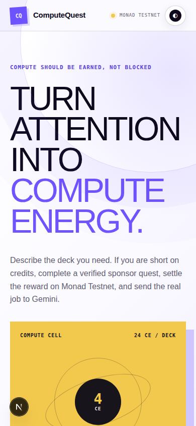
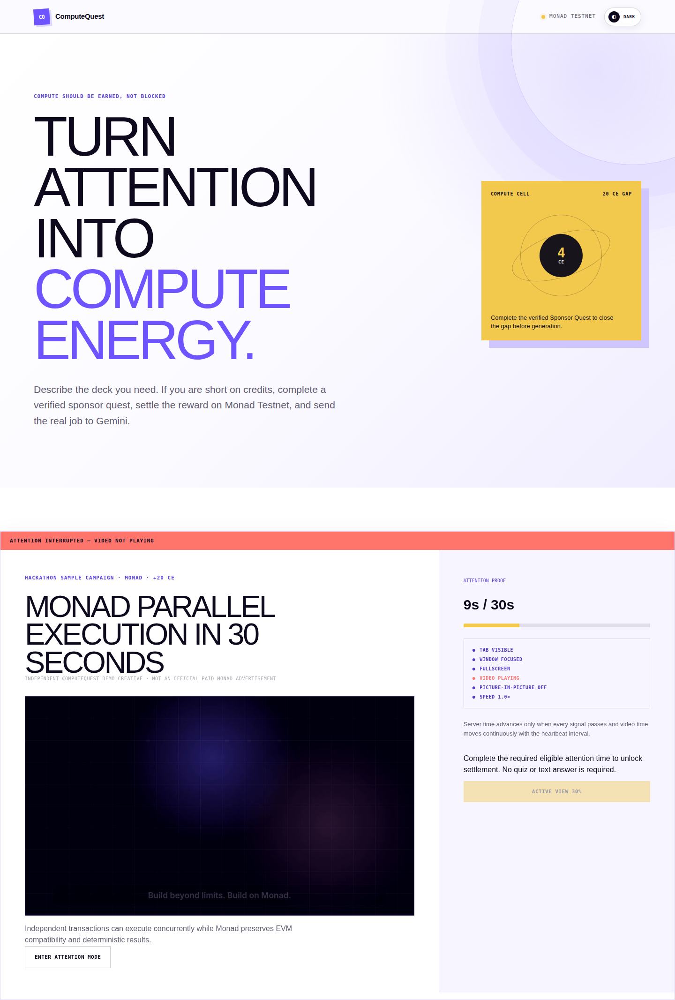

# ComputeQuest

> Turn verified sponsor attention into useful AI compute.

[Live app](https://computequest.onrender.com) · [Monad Testnet contract](https://testnet.monadvision.com/address/0xe9c37c275C78Bb9259F25e7C47471E54808dC94b) · [Verified settlement](https://testnet.monadvision.com/tx/0x01a79519e53c58fb849f6179cd212aba8833269b8d630b0e25df75b6abe48d70)

ComputeQuest is a sponsored-compute platform. A user requests useful AI work; if their balance is too low, they can voluntarily complete a short sponsor experience. ComputeQuest measures eligible active attention, settles a signed reward through a replay-protected contract on Monad Testnet, issues non-transferable Compute Energy (CE), and automatically starts the original Gemini job.

The current release proves one narrow workload end to end: an eight-slide pitch deck costing 24 CE. New sessions receive 4 CE, and one eligible campaign can cover the 20 CE funding gap before Gemini starts automatically.

## Product screenshots

<table>
  <tr>
    <td align="center"><strong>Request useful AI work</strong></td>
    <td align="center"><strong>Verify eligible attention</strong></td>
  </tr>
  <tr>
    <td></td>
    <td></td>
  </tr>
</table>

These responsive light-mode states were captured during local browser QA. The public deployment is linked above and serves the same Git revision as this repository; the complete hosted settlement-to-Gemini flow remains a separate verification boundary.

## How it works

```text
AI task (24 CE)
      ↓
Task accepted and safely queued (4 CE available)
      ↓
Choose an eligible Sponsor Quest (+20 CE)
      ↓
Server-timed eligible attention
      ↓
EIP-712 authorization → CampaignEscrow on Monad
      ↓
Finalized settlement → append-only CE grant
      ↓
Exactly-once task spend → Gemini generation → persisted result
```

The three economic actors stay separate:

- **Sponsor:** funds a campaign in exchange for an eligible attention session.
- **User:** contributes attention and receives CE that can purchase AI service inside ComputeQuest.
- **ComputeQuest:** verifies the session, relays settlement, accounts for CE, and runs the provider job.

Companies can submit a campaign-review request from the public **For Sponsors** section. ComputeQuest stores the company, contact, official website, campaign destination, public creative link, title, and 280-character description in PostgreSQL and returns a reference ID. Submission never publishes or funds a campaign automatically; brand authorization, commercial terms, creative review, and a separate Monad campaign remain operator-controlled.

CE is not a token, is not transferable, and is not presented as money. Users do not need a wallet in the current flow. The Monad creative is an independent educational campaign; Monad Testnet is the settlement network.

## Current status

| Boundary | Status | What is proven |
| --- | --- | --- |
| Public application | Live | Render serves the Next.js app; `/api/health` observes PostgreSQL and the expected Monad escrow/campaign state. |
| Monad settlement | Verified | Contract deployment, funded campaign `1`, source match, and one successful Testnet completion are publicly inspectable. |
| Local golden path | Passed | Real Chromium, PostgreSQL, server-timed attention, Testnet settlement, CE accounting, and Gemini structured output completed as one causal run. |
| Hosted golden path | Pending | The revised public Render deployment has not yet consumed another campaign completion and run the entire flow. |
| Sponsor intake | Public | The deployed operator-reviewed form validates and stores bounded campaign requests. Its hosted UI and rejection boundary are verified; the first genuine sponsor submission remains pending. |
| Real-money campaign | Not supported | Anonymous browser sessions are not a sufficient anti-Sybil boundary for open cash-backed rewards. |

## Contents

- [Architecture](#architecture)
- [Verified evidence](#verified-evidence)
- [Run locally](#run-locally)
- [Cost and credit accounting](#cost-and-credit-accounting)
- [Browser and media verification](#browser-and-media-verification)
- [API surface](#api-surface)
- [Security and correctness boundaries](#security-and-correctness-boundaries)
- [Deployment](#deployment)
- [Known limitations](#known-limitations)

## Architecture

```text
Next.js UI and route handlers
  ├── PostgreSQL / Drizzle: tasks, quest sessions, reward claims, append-only evidence and credit ledger
  ├── Gemini HTTPS API: schema-constrained pitch-deck generation
  └── viem: EIP-712 authorization and Monad Testnet settlement
                       │
                       ▼
              CampaignEscrow.sol
        budget custody + replay protection
```

Missing infrastructure fails visibly. The production path does not substitute fixture AI output or a local-chain success mode.

Completed presentations are rendered as slide previews and can be downloaded as the exact generated structured JSON. ComputeQuest does not claim PPTX or PDF export.

## Verified evidence

- Application: lint, TypeScript, 82 default Vitest tests, 20 real PostgreSQL integration tests, and production build pass.
- Contract: 5 Foundry tests cover valid settlement, replay rejection, wrong verifier, expiry, pause, withdrawal, and a viem/Solidity EIP-712 golden vector.
- Browser media: the controlled edge-state gate covers campaign selection, play, pause, buffering, ended, focus, and visibility boundaries. Separately, the production golden path earned 32,995 ms through the real heartbeat API in Chromium.
- Gemini: the configured `gemini-3.5-flash-lite` provider completed the golden-path pitch deck and persisted a completed job.
- Contract: [`0xe9c37c275C78Bb9259F25e7C47471E54808dC94b`](https://testnet.monadvision.com/address/0xe9c37c275C78Bb9259F25e7C47471E54808dC94b), campaign `1`, deployed and funded with `0.02` Testnet MON. Deployment transaction: [`0x8e4861…d8b67`](https://testnet.monadvision.com/tx/0x8e486125909d392c9a894d7199acb0283160dae32f67ca9b27154a9c5bbd8b67); campaign creation: [`0x4f8120…30726`](https://testnet.monadvision.com/tx/0x4f81205b061cd8386dbca5f2c083ac3f9613ee4a295013324633f93b07830726). Both receipts succeeded, runtime bytecode and campaign state were read back, and Sourcify reports a runtime source match.
- Live settlement proof: [`0x01a795…e48d70`](https://testnet.monadvision.com/tx/0x01a79519e53c58fb849f6179cd212aba8833269b8d630b0e25df75b6abe48d70), receipt status `0x1`, completion count `1`, campaign budget remaining `0.019` Testnet MON.
- Live application: [https://computequest.onrender.com](https://computequest.onrender.com)

## Run locally

Requirements: Node.js 20+, Corepack/pnpm, Foundry 1.8+ for Monad deployment/verification, and PostgreSQL. The current development machine has Foundry 1.8.1, and the contract builds and simulates successfully against Monad Testnet.

```bash
corepack pnpm install
cp .env.example .env.local
corepack pnpm db:migrate
corepack pnpm db:seed
corepack pnpm verify
corepack pnpm dev
```

Open [http://localhost:3000](http://localhost:3000). The app intentionally remains unavailable when its database, chain, campaign, or signing configuration fails preflight.

### Environment configuration

Copy `.env.example` to `.env.local` and provide:

- PostgreSQL connection and a stable session-signing secret;
- a server-only Gemini API key and configured model;
- Monad Testnet RPC, chain, explorer, deployed escrow, and deployment block;
- separate verifier and relayer keys;
- the PostgreSQL campaign UUID and confirmed numeric onchain campaign ID.

Never expose `GEMINI_API_KEY`, `VERIFIER_PRIVATE_KEY`, `RELAYER_PRIVATE_KEY`, `DATABASE_URL`, or `SESSION_SIGNING_SECRET` through a `NEXT_PUBLIC_` variable. The campaign UUID is an internal database identifier; it is not the numeric campaign ID emitted by `CampaignEscrow`.

### Real PostgreSQL integration gate

The ledger and heartbeat services have an opt-in integration suite that runs against PostgreSQL, not an in-memory adapter. Point it at an isolated migrated database:

```bash
DATABASE_URL=postgresql://... corepack pnpm db:migrate
INTEGRATION_DATABASE_URL=postgresql://... corepack pnpm test:integration:postgres
```

The suite truncates its target tables, so never point `INTEGRATION_DATABASE_URL` at a shared, staging, or production database.

The integration gate includes real concurrent transactions. A per-user PostgreSQL row lock serializes every balance decision against task spending, settlement crediting, provider refunds, and refunded-job retries. Tests prove two simultaneous 24 CE tasks fund exactly one job, and that a confirmed settlement racing a new task cannot produce a negative balance.

## Cost and credit accounting

ComputeQuest keeps three units separate:

- CE is an internal, non-transferable product entitlement.
- Monad settlement rewards are recorded in wei.
- Gemini provider cost is recorded in USD micros from a versioned pricing snapshot.

There is no CE-to-MON or MON-to-USD conversion. Each Gemini attempt stores the requested model, returned model version, service tier, token counts, response ID, and a published paid-standard replacement cost when the response can be priced safely. That number is not proof of the amount Google billed; actual billed cost stays null until it is reconciled against Google billing records. Cached, tool-assisted, or unsupported service-tier calls remain explicitly unpriced instead of using the wrong rate.

Provider jobs allow at most three total attempts, including stale-lease recovery. Every failed attempt has its own idempotent CE refund, so retrying cannot silently lose credits or create an unlimited provider-cost loop. If settlement persisted a funded job but its request stopped before Gemini started, reloading the task automatically invokes the idempotent job-claim endpoint; the database lease permits only one provider request. If the process loses the final provider result, the expired lease becomes a terminal failed job, the CE spend is refunded, and the UI tells the user to start a new task instead of making an unbounded fourth call. Operators can inspect aggregate usage without exposing prompts:

```bash
DATABASE_URL=postgresql://... corepack pnpm operator:provider-cost-report
```

Review persisted sponsor requests without exposing them through a public read endpoint:

```bash
DATABASE_URL=postgresql://... corepack pnpm operator:sponsor-inquiries
```

## Browser and media verification

`scripts/test-sponsor-video-browser.py` drives the real UI and shipped MP4 in Chromium. It requires Python Playwright 1.55+, Google Chrome, and Xvfb on a headless Linux machine:

```bash
xvfb-run -a python scripts/test-sponsor-video-browser.py
```

`scripts/test-sponsor-inquiry-browser.py` submits a non-commercial `example.com` request through the real local API and PostgreSQL, verifies keyboard navigation and the returned reference, and checks the 390 px layout:

```bash
python scripts/test-sponsor-inquiry-browser.py
```

The script controls API responses to reach the quest without misrepresenting local infrastructure as live. Playback, pause, and end are real media-element events; visibility/focus changes are injected browser state and are labeled in the output.

`scripts/test-runtime-readiness-browser.py` makes no API substitutions. Against an intentionally unconfigured local server it verifies the real HTTP 503 readiness boundary, disabled build action, health recheck, deferred session creation, and a 390 px layout without horizontal overflow:

```bash
python scripts/test-runtime-readiness-browser.py
```

Provide every variable in `.env.example`. `CAMPAIGN_ESCROW_DEPLOYMENT_BLOCK` is the public block number from the escrow deployment receipt and bounds paginated event recovery; update it whenever a new escrow is deployed. `GEMINI_API_KEY`, signing keys, and database credentials are server-only and must never use a `NEXT_PUBLIC_` prefix.

The deployment script at `contracts/script/DeployComputeQuest.s.sol` deploys the escrow and creates a funded Testnet campaign in one broadcast. It requires the values documented in `contracts/.env.contracts.example`; do not commit populated key files. Run `corepack pnpm contracts:preflight:testnet` first to verify Foundry, chain ID, derived public roles, campaign funding, and relayer funding without printing keys. Any later redeployment is intentionally manual because it spends faucet-backed Testnet MON and produces a new address and campaign identity.

After deployment, `corepack pnpm contracts:preflight:deployed` must observe the exact escrow and campaign state before Render handoff. `corepack pnpm contracts:verify:testnet` submits the compiler configuration and constructor address to MonadVision's Sourcify endpoint using the public `VERIFIER_ADDRESS`, never a private key CLI argument, and waits for the verification result. Both commands passed against the deployment above.

## API surface

- `GET /api/health` — configuration, live database query, observed Monad deployment/campaign preflight, and exact proof boundary.
- `POST /api/session` — create or restore a signed HttpOnly anonymous session with an idempotent 4 CE initial grant and return its current ledger balance.
- `POST /api/sponsor-inquiries` — validate and persist an operator-reviewed sponsor request. Only HTTPS creative links are accepted; duplicate client retries are idempotent and each signed browser session is limited to three submissions per 24 hours.
- `POST /api/tasks` — create a fixed-cost pitch-deck task.
- `GET /api/tasks/:taskId` — read persisted task state.
- `POST /api/tasks/:taskId/run` — atomically claim a funded job and call Gemini.
- `POST /api/jobs/:jobId/retry` — re-fund and retry a previously refunded provider job, up to the three-attempt cap, without losing ledger history.
- `GET /api/campaigns` — list active, sufficiently funded campaigns that can close the current CE gap and have not already rewarded this user.
- `POST /api/quests` — create a quest session for the exact selected campaign after a campaign-specific Monad preflight.
- `POST /api/quests/:sessionId/heartbeat` — accumulate server-authorized active time.
- `POST /api/quests/:sessionId/authorize` — verify the required eligible duration, then sign the EIP-712 receipt.
- `POST /api/quests/:sessionId/settle` — relay, confirm, atomically convert the settlement into credits, and automatically claim the funded Gemini job. Provider failure is returned separately from the already-confirmed settlement and refunds the job spend.

## Security and correctness boundaries

Credits are not granted merely because a transaction is mined. CE budget is reserved atomically before the verifier signs a receipt. The chain adapter then waits until Monad's `finalized` block reaches the settlement block, rechecks the consumed session hash, and converts the reservation into a grant. This prevents an onchain payout from succeeding after the offchain CE budget has already been promised elsewhere.

Settlement submission simulates the call, estimates its Monad gas requirement, applies a ceiling-rounded 10% buffer, rejects estimates that would exceed Monad's 30M transaction limit, and supplies that gas limit explicitly. This matters because Monad charges against the submitted gas limit rather than only the gas ultimately consumed.

Quest attempts expire after 15 minutes. Expiry is persisted server-side, stops heartbeat traffic, and lets the same task restart with a fresh nonce and zero accumulated time; an expired nonce can never be revived.

The Sponsor Quest player is campaign-driven rather than tied to one brand. The repository includes a captioned 40-second Monad educational video and an 18-second PayZoll partner creative, both generated reproducibly from Remotion compositions in `video/`. PayZoll requires a separate funded on-chain campaign before it can be activated in a deployed environment. Attention mode requires fullscreen and reports video time, duration, playback speed, visibility, focus, buffering, seeking, and Picture-in-Picture state. The server compares video-time movement with its own heartbeat interval before crediting time; a forward seek, rate change, oversized gap, hidden document, lost focus, fullscreen exit, buffering event, or stopped video earns zero for that interval. Credited time is capped at the campaign requirement and persisted as `ATTENTION_VERIFIED` before the user explicitly claims the reward.

The Monad creative is an independent educational campaign; Monad Testnet is the settlement network. Each persisted user can receive at most one successful reward from a campaign. `campaign_reward_claims` separates that invariant from restartable quest attempts: the original verified quest can retry a failed settlement, while a different task cannot claim the same campaign reward.

The current identity is a signed anonymous browser session. Clearing that identity is outside the protection offered by the one-user database constraint, so the public Testnet campaign must stay capped. A cash-backed campaign requires durable identity or a closed allowlist before sponsor funds are exposed.

Sponsor inquiry links are stored but never fetched, embedded, or published automatically. The requester must confirm that they represent the company or have permission to share the creative. Contact data is available only through the database-backed operator command; there is no public inquiry-list endpoint.

Every accepted heartbeat also writes an append-only `attention_events` record with its server timestamp, proof signals, credited milliseconds, eligibility reason, and SHA-256 event hash. This is auditable server-side evidence, not a claim that a browser can lock the rest of the operating system.

Signed completion receipts have a separate 10-minute onchain lifetime. If an unsubmitted receipt expires, the backend persists a settlement failure without broadcasting it and rechecks the verified attention session before replacing the signature. A receipt with a submitted or confirmed transaction is never reset by this recovery path.

Every relay claim creates an append-only settlement-attempt record. Reverted and submission-failed attempts retain their transaction hash or failure reason, while the settlement aggregate can safely move to a later attempt. Relayer writes are serialized within one application instance. If the process stops after broadcasting but before saving the hash, the backend recovers it from the indexed `CompletionSettled` event before continuing finalization. `GET /api/tasks/:taskId` returns the sanitized ordered attempt history with JSON-safe block numbers for reload recovery and operational evidence.

The six-stage interface is derived from persisted task, quest, settlement, and job states: Brief → Fund → Attention → Monad settlement → AI working → Result. Completion stops tracking, exits fullscreen, refreshes the persisted task snapshot, removes the finished quest, and reveals the generated result without requiring a manual Escape key or page reload.

The Compute Cell reads the same persisted ledger state instead of animating a decorative balance: it shows a semantic `4 / 24 CE` meter and the real `4 available + 20 Sponsor Quest = 24 task cost` equation, followed by the post-spend AI-working state, completion, or a provider refund. If the initial anonymous-session handshake fails transiently, the interface remains disabled and exposes an explicit retry instead of silently creating work without an authenticated ledger owner.

`GET /api/health` returns `ready` only after a live PostgreSQL query and a read-only Monad preflight observe the expected chain ID, deployed escrow bytecode, verifier, active campaign, configured reward, remaining capacity and budget, relayer payout recipient, and a relayer balance above `RELAYER_MIN_BALANCE_WEI`. The preflight never sends a valid signed receipt to an RPC. Quest creation, authorization, and settlement enforce the same cached preflight before mutating state. Gemini remains `configured_unverified` until a real generation succeeds.

## Deployment

`render.yaml` prepares one free Node web service and one free PostgreSQL database in Singapore. Because Render's pre-deploy command is a paid-service feature, the free service runs idempotent migrations and campaign seeding during its build phase, then starts Next.js directly within the free runtime memory limit.

The current public service is [computequest.onrender.com](https://computequest.onrender.com). Treat `/api/health` as the release gate: it must return `ready` only after observing the database and the expected read-only Monad deployment state. Deploying the UI alone does not prove the hosted golden path.

## Known limitations

- Identity is a signed anonymous browser session. Clearing it can create a new identity, so this release must not expose an uncapped cash-backed campaign.
- Relayer transaction serialization is process-local. Multiple web instances require a database-backed outbox or dedicated nonce manager.
- The deployed Testnet campaign proves settlement mechanics; it is not evidence of commercial sponsor revenue.
- CE is an internal service entitlement. There is no CE-to-MON or CE-to-fiat redemption path.
- Gemini replacement-cost estimates use published pricing metadata; they are not reconciled Google invoice costs.
- Render's free PostgreSQL instances expire after 30 days and are unsuitable for durable production storage.
- The current AI workload returns structured slide JSON and previews, not PPTX or PDF files.
- The browser can measure eligible active-attention signals, but it cannot prevent activity on another application, device, or monitor.

These boundaries are intentional. The next production milestone is durable user identity and a capped, authorized sponsor pilot—not a larger feature surface.
